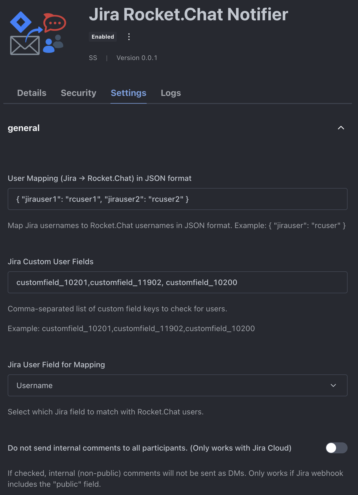

# Jira Rocket.Chat Notifier App

## Overview
Jira Rocket.Chat Notifier is a Rocket.Chat app that receives notifications from Jira via webhooks and sends direct messages (DMs) to all relevant participants and watchers in Rocket.Chat. It is designed for teams who want to stay updated on Jira activity without relying on email notifications.

## Features
- Receives Jira webhook notifications
- Parses issue events and extracts participants/watchers
- **Supports native Jira approvers field** (and legacy custom fields)
- Sends DMs to mapped Rocket.Chat users (with deduplication)
- **Admin-configurable custom user fields for participant extraction**
- Optional user mapping configuration (Jira username → Rocket.Chat username)
- **Option to skip internal comments (Jira Service Management Cloud only)**
- Admin-configurable settings

## Installation
Install this app from RocketChat Marketplace or download the release zip and upload it under "Private Apps".

## Configuration
### App Settings

## App Settings Example
Below is a screenshot of the app settings in Rocket.Chat:



- **User Mapping JSON**: (Optional) In the app settings, provide a JSON object mapping Jira usernames to Rocket.Chat usernames. This is useful if your usernames differ between systems.
  - Example:
    ```json
    {"jirauser1": "rcuser1","jirauser2": "rcuser2"}
    ```
- **User Mapping Field**: Select which Jira field to use for mapping (e.g., `name`, `emailAddress`).
- **Jira Custom User Fields**: (Optional, recommended for custom Jira setups)
  - Setting: `Jira_Custom_User_Fields`
  - Description: Comma-separated list of Jira custom field keys to parse for user objects (e.g., `customfield_10201,customfield_11902`).
  - The app will extract users from these fields (handles both arrays and single user objects) in addition to standard fields like assignee, reporter, creator, and **approvers**.
- **Skip Internal Comments**: (Jira Cloud only)
  - Setting: `Do not send internal comments to all participants. (Only works with Jira Cloud)`
  - If enabled, internal (non-public) comments will not be sent as DMs. Only works if Jira webhook includes the `public` field in comment payloads.


## Setting Up Jira Webhooks
1. **In Jira, go to**: Project Settings → Webhooks (or System → Webhooks for global setup).
2. **Create a new webhook**:
   - **URL**: `https://<Rocketchat-Server-URL>/api/apps/public/4190d196-2ed8-4198-bc3d-53402d6f82b3/jira-rc-notifier-webhook`
     - Validate URL from Deatils page in App Settings on Rocket.Chat 
     - Replace `<Rocketchat-Server-URL>` with your actual values.
   - **Events**: Select the issue events you want to notify (created, updated, commented, etc.).
   - **Payload**: Use the default or customize as needed. For best results, ensure the webhook includes the `public` field for comments (Jira Service Management Cloud).
3. **Save the webhook.**

## Usage
- When a Jira event occurs, the app receives the webhook, parses the payload, and sends DMs to all mapped Rocket.Chat users who are participants or watchers.
- **Participants include:** assignee, reporter, creator, watchers, native Jira approvers, and users from custom fields.
- Errors (such as unmapped users or DM failures) are logged in the Rocket.Chat app logs.


## Contributing, Testing & Development Workflow
To contribute, test and iterate on this app during development:

## Contributing
Pull requests and suggestions are welcome!

1. **Clone or download this repository.**
2. **Install the Rocket.Chat apps CLI and dependencies:**
   ```sh
   npm install -g @rocket.chat/apps-cli
   npm install
   ```
3. **Build the app:**
   ```sh
   rc-apps package
   ```
4. **[Optional] Set Up a Local Rocket.Chat Server**
   - Start a local server with Docker:
     ```sh
     # Setup Mongo DB
     docker run --name db -d mongo:7.0 --replSet rs0 --oplogSize 128
     docker exec -it db mongosh --eval 'rs.initiate()'

     # Setup Rocket.Chat
     docker run \
      --name rocketchat \
      --link db \
      -e MONGO_URL=mongodb://db:27017/rocketchat \
      -e MONGO_OPLOG_URL=mongodb://db:27017/local \
      -e ROOT_URL=http://localhost:3000 \
      -e PORT=3000 \
      -p 3000:3000 \
      -d rocket.chat

     OR on MacoOS Silicon

     docker run --platform linux/amd64 \
      --name rocketchat \
      --link db \
      -e MONGO_URL=mongodb://db:27017/rocketchat \
      -e MONGO_OPLOG_URL=mongodb://db:27017/local \
      -e ROOT_URL=http://localhost:3000 \
      -e PORT=3000 \
      -p 3000:3000 \
      -d rocket.chat
     ```
   - Access at: [http://localhost:3000](http://localhost:3000)
   - Create an admin user on first login.

5. **Upload the packaged app (.zip) to your Rocket.Chat server via the Admin UI. Or deploy using below:**
   ```sh
   rc-apps deploy --url <RocketChat Instance URL> --username <Admin User> --password <Admin pasword>
   ```

6. **Test the Webhook Endpoint**
   - Use a tool like **curl** or **Postman** to POST your sample payload (e.g., `payload.json`) to your app's endpoint:
     ```sh
     curl -X POST http://<RocketChat Instance URL>/api/apps/public/<your-app-id>/jira-rc-notifier-webhook \
       -H "Content-Type: application/json" \
       -d @payload.json
     ```
   - Replace `<RocketChat Instance URL>` and `<your-app-id>` with the actual app ID (see app settings or `app.json`).

7. **Check Results**
   - **DMs:** Log in as the target Rocket.Chat users and check for direct messages.
   - **Logs:** Go to **Administration → Apps → Logs** to see your app's logs (including debug info and errors).

8. **Iterate Quickly**
   - Make code changes.
   - Run `rc-apps deploy ...` again to hot-reload your app.
   - Re-test as above.

## Troubleshooting
- **No DMs received?**
  - Check that the webhook URL is correct and accessible from Jira.
  - Ensure the app is enabled and permissions are granted.
  - Verify user mapping (if used) is correct and valid JSON.
  - Check Rocket.Chat logs for errors.
- **User not found?**
  - Make sure the Jira username (or mapped username) matches a Rocket.Chat username.
- **Need to map users?**
  - Use the app setting to map users in JSON format. Example: {"jirauser1": "rcuser1","jirauser2": "rcuser2"}
- **Custom user fields not working?**
  - Double-check the field keys in the `Jira_Custom_User_Fields` setting match your Jira instance's custom field keys.

## License
MIT