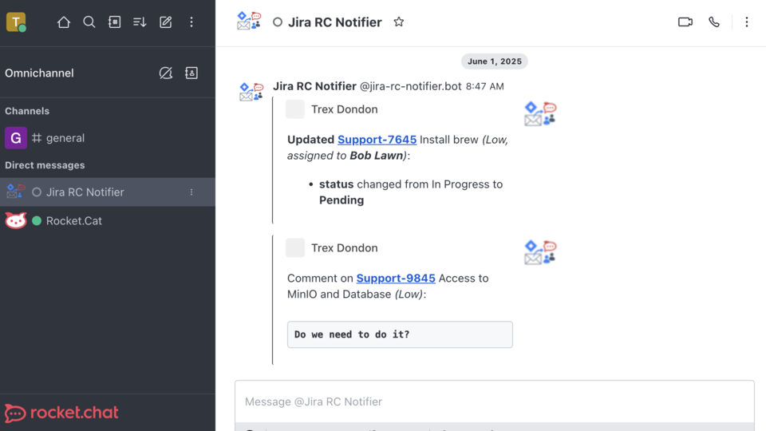
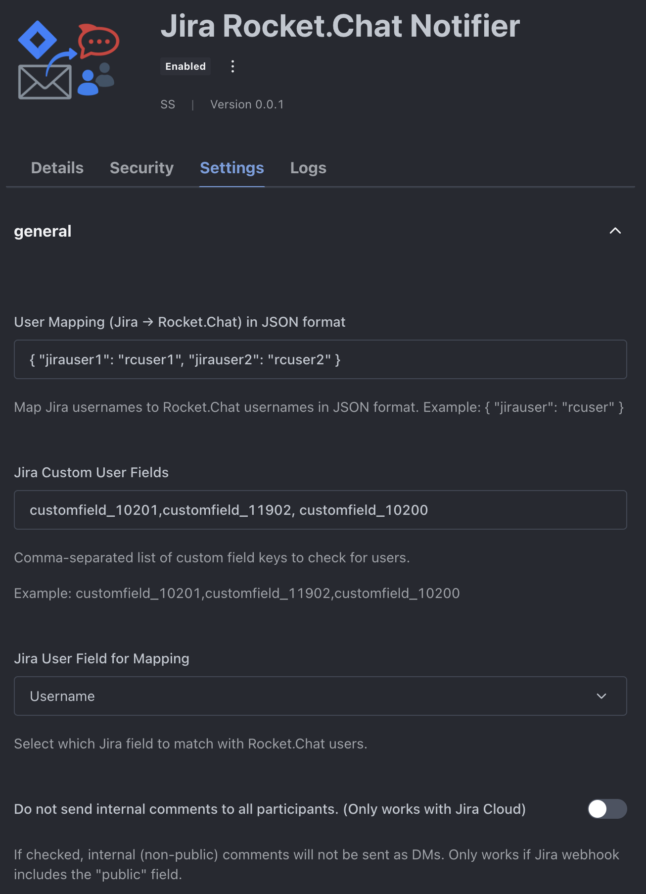

# Jira Rocket.Chat Notifier App

A Rocket.Chat application that listens for Jira webhook events and sends direct messages (DMs) to relevant participants. Ideal for teams who want real-time Jira updates in Rocket.Chat instead of email.

---

## Table of Contents

1. [Overview](#overview)  
2. [Features](#features)  
3. [Installation](#installation)  
4. [Configuration](#configuration)  
   - [App Settings](#app-settings)  
   - [Settings Examples](#settings-examples)  
5. [Setting Up Jira Webhooks](#setting-up-jira-webhooks)  
6. [Usage](#usage)  
7. [Contributing & Development](#contributing--development)  
8. [Troubleshooting](#troubleshooting)  
9. [License](#license)  

---

## Overview

**Jira Rocket.Chat Notifier** receives Jira webhook notifications and delivers them as direct messages to Rocket.Chat users (assignees, reporters, watchers, approvers, and more). No more missed updates—stay on top of Jira activity directly in your chat workspace.



---

## Features

- 📩 **DM Notifications**  
  Automatically sends DMs when configurable Jira events occur (issue created, updated, commented, etc.).  

- 🔍 **Participant Extraction**  
  - Standard fields: assignee, reporter, creator, watchers  
  - Native Jira approvers & custom approval fields (legacy and modern)  
  - Custom user fields (admin-configurable)  

- 🔄 **User Mapping**  
  Map Jira usernames (or email addresses) to Rocket.Chat usernames via JSON.  

- ⚙️ **Configurable Settings**  
  - Custom fields for participant lookup  
  - Select which Jira user field to use (e.g. `name` vs. `emailAddress`)  
  - Option to skip internal comments (Jira Cloud only)  

---

## Installation

1. **Marketplace**  
   - Find and install “Jira Rocket.Chat Notifier” from the Rocket.Chat Marketplace.  

2. **Manual Upload**  
   - Download the latest release ZIP.  
   - In Rocket.Chat, go to **Administration → Apps → Upload App** and upload the ZIP file.  

---

## Configuration

### App Settings

After installation, navigate to **Administration → Apps → Jira Rocket.Chat Notifier → Settings**.

| Setting Key              | Type   | Required | Description                                                                                       | Example                                                                 |
| ------------------------ | ------ | -------- | ------------------------------------------------------------------------------------------------- | ----------------------------------------------------------------------- |
| `user_mapping_json`      | String | No       | JSON mapping: Jira username → Rocket.Chat username.                                               | `{"jirauser1":"rcuser1","jirauser2":"rcuser2"}`                        |
| `user_mapping_field`     | Select | No       | Jira field used for mapping (e.g., `name`, `emailAddress`).                                       | Select **Username** or **Email** in dropdown.                          |
| `custom_user_fields`     | String | No       | Comma-separated Jira field keys to parse for user objects (plain or approval objects).           | `customfield_10201,customfield_11902`                         |
| `skip_internal_comments` | Bool   | No       | (Jira Cloud only) Do not send DMs for internal (non-public) comments.                             | Check the box to enable.                                               |

> **Note:** For large JSON mappings, we recommend editing in a code editor and pasting into the field.

---

### Settings Examples



1. **User Mapping JSON**  
   - Map different Jira vs. Rocket.Chat usernames.  
   - Example JSON:
     ```json
     {
       "jirauser1": "rcuser1",
       "jirauser2": "rcuser2"
     }
     ```
2. **User Mapping Field**  
   - Choose which Jira field to match (e.g., `name` or `emailAddress`).  
   - If your Jira emails match Rocket.Chat usernames, select **Email**.
3. **Jira Custom User Fields**  
   - Enter any fields (plain users or approval lists) separated by commas.  
   - Example:  
     ```
     customfield_10201,customfield_11902,approvers
     ```
4. **Skip Internal Comments**  
   - Only works if Jira webhook payload includes a `public` flag on comments.  
   - When enabled, internal comments are not delivered as DMs.

---

## Setting Up Jira Webhooks

1. **Go to Jira →**  
   - **Project Settings → Webhooks**, or  
   - **System → Webhooks** (for global configuration).  

2. **Create a New Webhook:**  
   - **URL:**  
     ```
     https://<ROCKETCHAT_URL>/api/apps/public/<APP_ID>/jira-webhook
     ```
     - Replace `<ROCKETCHAT_URL>` with your Rocket.Chat domain.  
     - Replace `<APP_ID>` with your app’s ID (found in **Private Apps → Jira Rocket.Chat Notifier → Details**).  
   - **Events:**  
     Select relevant issue events (Created, Updated, Commented, etc.).  
   - **Payload:**  
     Ensure the payload includes comment visibility (`public` flag) if using “Skip Internal Comments.”  

3. **Save & Test:**  
   - Save the webhook and trigger a test event.  
   - Check Rocket.Chat for incoming DMs.

---

## Usage

1. **Trigger a Jira Event**  
   When an issue is created, updated, or commented, Jira will POST to your Rocket.Chat app.  

2. **Participant Extraction:**  
   - **Standard users:** assignee, reporter, creator, watchers  
   - **Native “approvers”:** If Jira’s payload includes a top-level `approvers` array  
   - **Legacy “approval” fields:** Configured in **`custom_user_fields`**  
   - **Webhook user:** The user who triggered the event (e.g., commenter)  

3. **User Mapping & DM:**  
   - If `user_mapping_json` is provided, the app looks up the Rocket.Chat username.  
   - If not found, it falls back to the selected `user_mapping_field` from Jira.  
   - DMs are sent to each unique user; failures are recorded in logs.  

4. **Result:**  
   Rocket.Chat users receive a DM with an attachment containing:  
   - Issue key & summary (linked to Jira issue)  
   - Event type and description  
   - Author, icon, and timestamp (if enabled)  

---

## Contributing & Development

Pull requests, issues, and feedback are welcome! To set up a local development environment:

1. **Clone the Repository**  
   ```bash
   git clone https://github.com/jeet0733/jira-rc-notifier.git
   cd jira-rocketchat-notifier
   ```
2. **Install Dependencies & CLI**
   ```bash
   npm install
   npm install -g @rocket.chat/apps-cli
   ```
3. **Build the app:**
   ```sh
   rc-apps package
   ```
4. **(Optional) Set Up a Local Rocket.Chat Server**
     ```sh
     # Start Mongo DB
     docker run --name db -d mongo:7.0 --replSet rs0 --oplogSize 128
     docker exec -it db mongosh --eval 'rs.initiate()'

     # Start Rocket.Chat
     docker run \
      --name rocketchat \
      --link db \
      -e MONGO_URL=mongodb://db:27017/rocketchat \
      -e MONGO_OPLOG_URL=mongodb://db:27017/local \
      -e ROOT_URL=http://localhost:3000 \
      -e PORT=3000 \
      -p 3000:3000 \
      -d rocket.chat

     OR on MacoOS Silicon

     docker run --platform linux/amd64 \
      --name rocketchat \
      --link db \
      -e MONGO_URL=mongodb://db:27017/rocketchat \
      -e MONGO_OPLOG_URL=mongodb://db:27017/local \
      -e ROOT_URL=http://localhost:3000 \
      -e PORT=3000 \
      -p 3000:3000 \
      -d rocket.chat
     ```
   - Access at [http://localhost:3000](http://localhost:3000) and create an admin account on first login.
  
5. **Upload the packaged app (.zip) to your Rocket.Chat server via the Admin UI. Or deploy using below:**
   ```sh
   rc-apps deploy --url <RocketChat-Server-URL> --username <Admin User> --password <Admin pasword>
   ```

6. **Test the Webhook Endpoint**
   - Use a tool like **curl** or **Postman** to POST a sample JIRA payload (e.g., `payload.json`) :
     ```sh
     curl -X POST http://<RocketChat-Server-URL>/api/apps/public/<your-app-id>/jira-rc-notifier-webhook \
       -H "Content-Type: application/json" \
       -d @payload.json
     ```
   - Replace `<RocketChat-Server-URL>` and `<your-app-id>` with the actual app ID (see app settings or `app.json`).

7. **Check Results**
   - **DMs:** Log in as the target Rocket.Chat users and check for direct messages.
   - **Logs:** Go to **Administration → Apps → Logs** to see your app's logs (including debug info and errors).

8. **Iterate Quickly**
   - Make code changes.
   - Run `rc-apps deploy ...` again to hot-reload your app.
   - Re-test as above.

## Troubleshooting
- **No DMs Sent?**
  - Verify your Jira webhook URL is correct and accessible from Jira.
  - Ensure the app is enabled and permissions are granted.
  - Check that Jira usernames (or mapped usernames) exist in Rocket.Chat.
  - Check Rocket.Chat logs for errors. (http://<RocketChat-Server-URL>/admin/settings/Logs)
- **User not found?**
  - Make sure the Jira username (or mapped username) matches a Rocket.Chat username.
  - Use the app setting to map users in JSON format. Example: {"jirauser1": "rcuser1","jirauser2": "rcuser2"}
- **Custom User Fields Not Extracting?**
  - Double-check the field keys in the `Jira_Custom_User_Fields` setting match your Jira instance's custom field keys.
- **Internal Comments Still Going Out**
  - Ensure your webhook payload includes a public flag on comments (Jira Cloud).
  - Enable Skip Internal Comments in app settings.

## License
This project is licensed under the MIT.